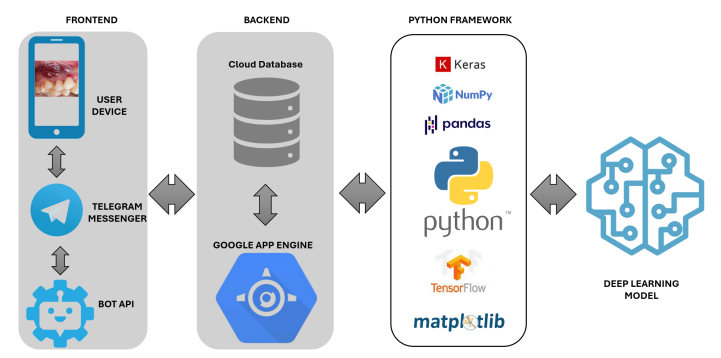

# Early Oral Cancer Detection with AI  
**Design and Implementation of a Deep Learning Image-based Chatbot**

## 📌 Description
This repository contains the code, datasets, and workflows used in the study titled:  
**“Early Oral Cancer Detection with AI: Design and Implementation of a Deep Learning Image-based Chatbot.”**

The study presents a novel patient-centered chatbot that integrates **deep learning image classification** and **natural language processing (NLP)** to support early detection, symptom triage, and health education for oral cancer.  

We evaluated multiple CNN-based architectures, implemented preprocessing pipelines, and deployed an interactive chatbot capable of real-time image-based assessment and personalized conversational support.

---

## 📂 Repository Structure
- ├── chatbot
- │ └── Chatbot.py # Chatbot code with NLP + image classifier integration
- │
- ├── dataset
- │ ├── cancer/ # 500 images (Oral Cancer cases)
- │ └── non-cancer/ # 450 images (Non-Cancer cases)
- │
- ├── models
- │ ├── Train_DenseNet121.ipynb
- │ ├── Train_DenseNet121_CAM.ipynb
- │ ├── Train_DenseNet169.ipynb
- │ ├── Train_DenseNet201.ipynb
- │ ├── Train_EfficientNetB0_V2.ipynb
- │ ├── Train_ResNet101.ipynb
- │ └── Train_Xception_V2.ipynb
- │
- └── preprocessed
- └── Preprocessed.ipynb # Preprocessing pipeline


## 📊 Dataset Information
This project uses two publicly available datasets:

- **Kaggle Oral Cancer Image Dataset**  
  📎 [Dataset Link](https://www.kaggle.com/datasets/zaidpy/oral-cancer-dataset)  
  - Label structure: Binary (`Cancer` / `No Cancer`)  
  - Format: JPEG images  
  - Total Images: ~1000  

The dataset was preprocessed with:
- Resizing (224x224 px)  
- Normalization  
- Train/validation/test splits  

---

## ⚙️ Models and Training
The following deep learning models were trained and compared:  
- DenseNet121  
- DenseNet121 + CAM (with interpretability)  
- DenseNet169  
- DenseNet201  
- EfficientNetB0 V2  
- ResNet101  
- Xception V2  

**Performance Evaluation Metrics:**  
- Accuracy  
- Sensitivity  
- Specificity  
- Diagnostic Odds Ratio (DOR)  
- Cohen’s Kappa  

📌 **Best-performing model:** *InceptionV3* (reported in the study)  
- Accuracy: **77.6%**  
- DOR: **20.67**  

---

## 🛠️ Preprocessing
`Preprocessed.ipynb` handles:  
- Dataset loading & inspection  
- Image resizing and normalization  
- Class balancing  
- Data augmentation  
- Saving processed data for training  

---

## 🤖 Chatbot
The chatbot (`Chatbot.py`) provides:  
- Real-time **image-based oral cancer assessment**  
- **Class Activation Mapping (CAM)** for interpretability  
- **Conversational interface (NLP)** to deliver guidance and education  
- Multilingual support (web and mobile deployment)  

---

## 🚀 How to Run

1. Clone the repository:
   ```bash
   git clone https://github.com/your_username/oral-cancer-chatbot.git
   cd oral-cancer-chatbot

2. Install dependencies:
    ```bash
    pip install -r requirements.txt

3. Preprocess dataset:
   ```bash
   Run preprocessed/Preprocessed.ipynb

5. Train models:
   - Use notebooks inside /models/
  
6. Run chatbot:
   ```bash
   python chatbot/Chatbot.py

## 🧪 Methodology
- CNN architectures were fine-tuned using **transfer learning**.  
- **Class Activation Mapping (CAM)** was integrated for model explainability.  
- Evaluation performed using **5-fold cross-validation**.  
- Models were benchmarked across **accuracy, sensitivity, specificity, and Diagnostic Odds Ratio (DOR)**.  

## 🏗️ System Architecture

